# Active-Directory-IAM-Home-Lab

### 1. Virtual Environment Provisioning

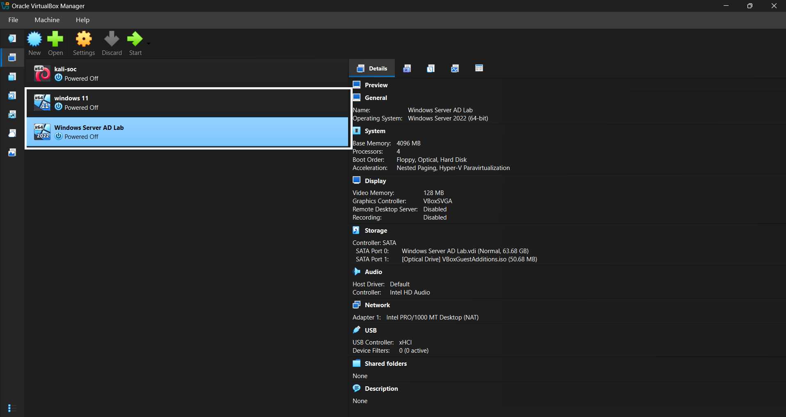
* **Objective:** Establishing isolated virtual machines to simulate an on-premise enterprise network architecture.
* **Configuration:** Provisioned two Oracle VirtualBox VMs: a Windows Server 2022 (64-bit) instance acting as the Domain Controller (`Windows Server AD Lab`) and a Windows 11 endpoint for client testing[cite: 40].
* **Engineering Impact:** Creates a safe, sandboxed environment for testing network policies, domain binding, and identity management without impacting host networks.

---

### 2. Domain Controller Network Configuration

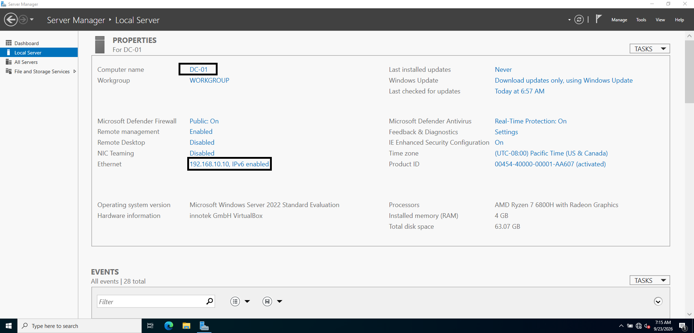
* **Objective:** Configuring a static IPv4 identity to ensure high availability and predictable routing for network services.
* **Configuration Details:** Renamed the server from an auto-generated string to `DC-01` for standardized naming conventions[cite: 41]. Statically assigned the ethernet adapter to `192.168.10.10`[cite: 41].
* **System Impact:** Prevents IP lease expirations from breaking AD DS and DNS services, which require a fixed address to process client authentication requests.

---

### 3. Core Network & Identity Role Installation

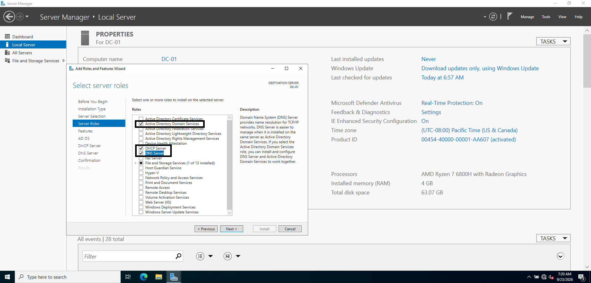
* **Objective:** Installing the foundational Windows Server roles required to manage local domain infrastructure.
* **Roles Selected:** Selected `Active Directory Domain Services` (AD DS), `DHCP Server`, and `DNS Server` from the Server Manager deployment wizard[cite: 42].
* **Engineering Impact:** Equips the standalone server with the necessary binaries to handle user authentication, dynamic IP allocation, and local hostname resolution.

---

### 4. Server Promotion to Domain Controller

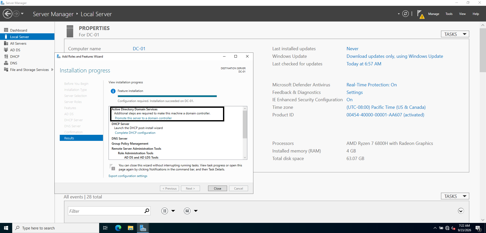
* **Objective:** Executing the post-deployment configuration wizard to elevate the standalone server into a primary Domain Controller.
* **Action Performed:** Triggered the `Promote this server to a domain controller` workflow following successful feature installation[cite: 43].
* **System Impact:** Initializes the creation of a new AD forest, establishes the NTDS database, and configures the SYSVOL share for Group Policy distribution.

---

### 5. Active Directory Forest Initialization

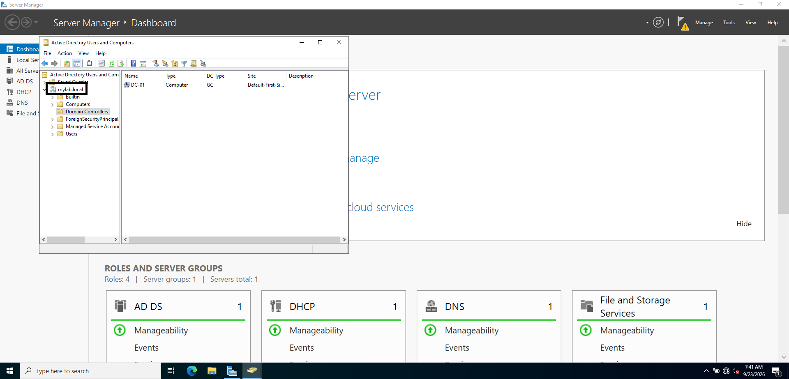
* **Objective:** Validating the successful creation and structural integrity of the newly promoted domain.
* **Verification:** Opened Active Directory Users and Computers (ADUC) to verify the root domain `mylab.local` is active and accessible[cite: 44].
* **Operational Insight:** Confirms the AD DS database is mounted and ready for organizational unit (OU) design and user account provisioning.

---

### 6. DNS Reverse Lookup Configuration

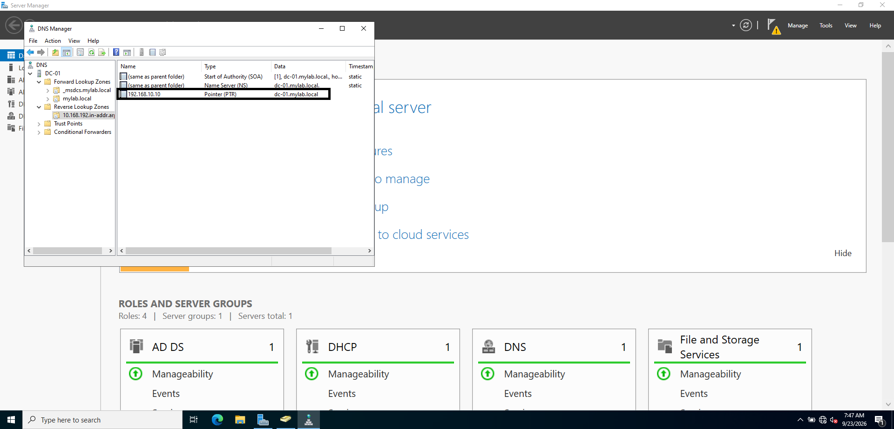
* **Objective:** Configuring DNS to resolve IP addresses back to domain hostnames for secure network auditing and kerberos authentication.
* **Configuration Details:** Created a Reverse Lookup Zone and established a Pointer (PTR) record mapping `192.168.10.10` to `dc-01.mylab.local.`[cite: 45].
* **Engineering Impact:** Essential for network troubleshooting (like `nslookup`), validating trusted endpoints, and preventing domain authentication errors.

---

### 7. Network Adapter DNS Alignment

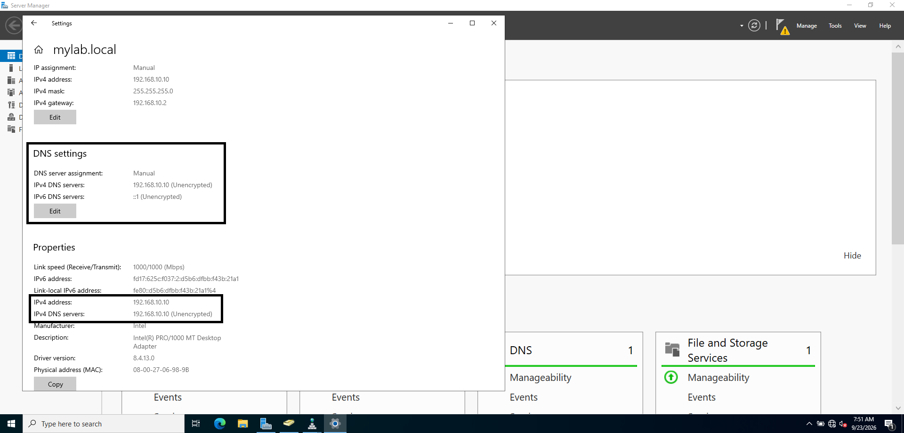
* **Objective:** Forcing the Domain Controller to utilize its own local DNS server role for name resolution.
* **Configuration Details:** Updated the server's network adapter IPv4 DNS server assignment to point directly to `192.168.10.10`[cite: 46].
* **System Impact:** Ensures all local server queries are handled by the domain's primary DNS zone, preventing external internet resolution conflicts.

---

### 8. DHCP Scope Initialization

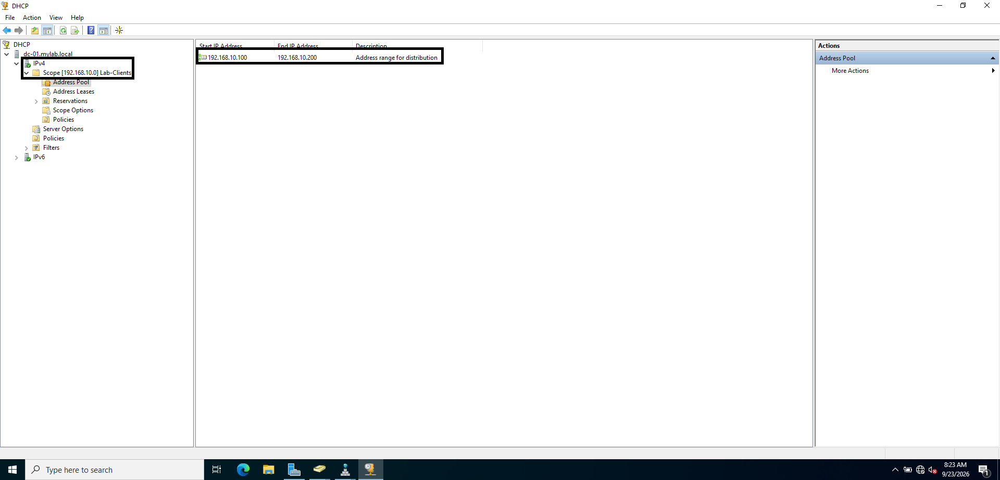
* **Objective:** Automating endpoint IP provisioning by configuring a local DHCP address pool.
* **Configuration Details:** Created an IPv4 Scope named `[192.168.10.0] Lab-Clients` and authorized a distribution pool ranging from `192.168.10.100` to `192.168.10.200`[cite: 47].
* **System Impact:** Eliminates manual static IP configuration for enterprise clients, allowing seamless onboarding of new workstations onto the domain network.

---

### 9. Client DHCP Lease Verification

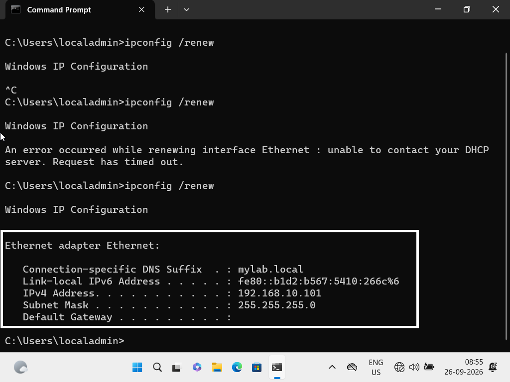
* **Objective:** Validating that the Windows 11 client can successfully communicate with the DC and pull a dynamic network configuration.
* **Test Execution:** Ran `ipconfig /renew` via the Windows 11 Command Prompt.
* **Results:** The client successfully leased IP `192.168.10.101` from the pool, received a `255.255.255.0` subnet mask, and automatically inherited the `mylab.local` connection-specific DNS suffix[cite: 48].

---

### 10. Active Directory Domain Join

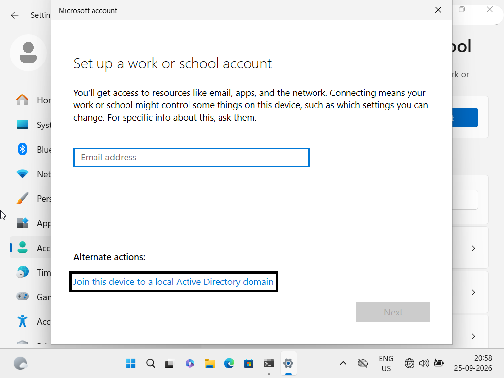
* **Objective:** Binding the Windows 11 endpoint to the enterprise domain to enforce centralized management and group policy.
* **Action Performed:** Navigated to Windows 11 Settings $\rightarrow$ Access work or school $\rightarrow$ and initiated the `Join this device to a local Active Directory domain` protocol[cite: 49].
* **Engineering Impact:** Transitions the device from a standalone workgroup machine into a managed enterprise asset, requiring AD credentials for login and subjecting the OS to domain security policies.

---

### 11. Organizational Unit (OU) & User Provisioning

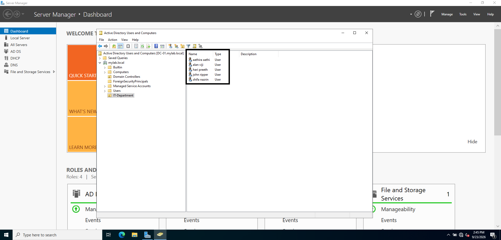

* **Objective:** Structuring directory hierarchy and provisioning enterprise user identities.
* **Configuration Details:** Created a dedicated `IT-Department` Organizational Unit (OU) within the `mylab.local` domain[cite: 50]. Provisioned standard user accounts for team members (e.g., `aathira aathi`, `alan viji`, `hari preeth`, `john ripper`, `shifa nazrin`)[cite: 50].
* **Engineering Impact:** Establishes a logical container for applying targeted security policies and delegating administrative control based on departmental boundaries.

---

### 12. Security Group Creation & Membership

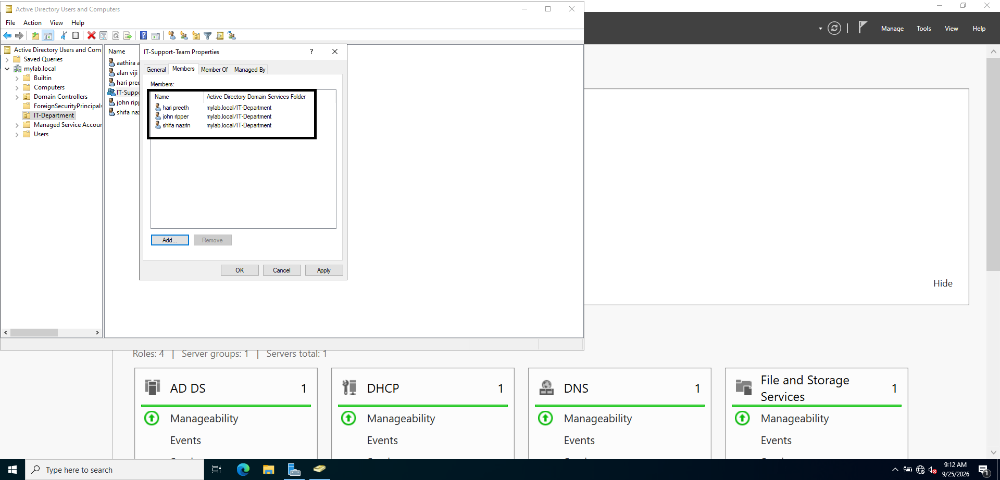

* **Objective:** Implementing Role-Based Access Control (RBAC) via Active Directory Security Groups.
* **Configuration Details:** Created an `IT-Support-Team` security group[cite: 51]. Populated the group with specific user accounts (`hari preeth`, `john ripper`, `shifa nazrin`)[cite: 51].
* **System Impact:** Enables centralized permission management, ensuring file share access and administrative rights are granted to functional groups rather than individual users, which streamlines offboarding and role transfers.

---

### 13. Group Policy Object (GPO) Initialization & Linking

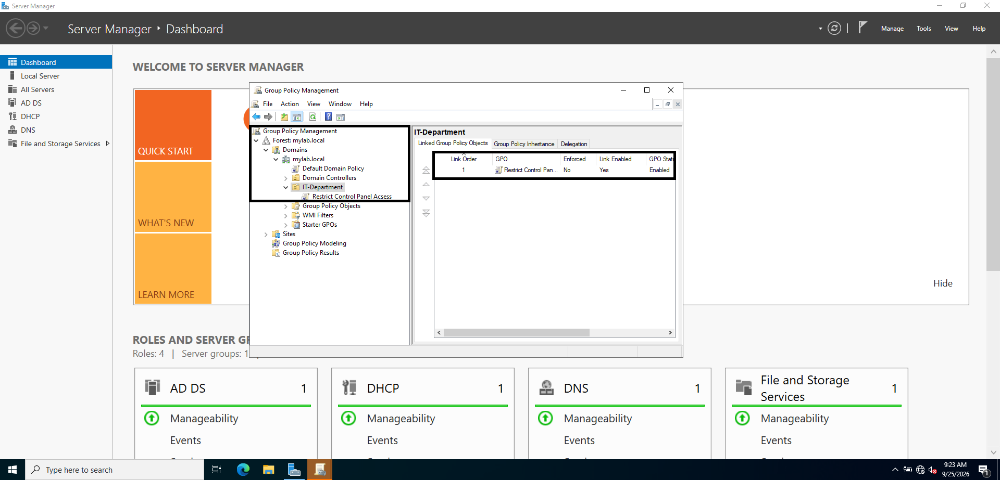

* **Objective:** Creating and linking a Group Policy Object to enforce security baselines on specific departmental containers.
* **Configuration Details:** Created a new GPO named `Restrict Control Panel Acess` and linked it directly to the `IT-Department` OU inside the Group Policy Management Console[cite: 52]. The link was confirmed as enabled[cite: 52].
* **Engineering Impact:** Ensures that any user or computer object placed within the targeted OU automatically inherits the defined security restrictions upon their next policy refresh cycle.

---

### 14. GPO Rule Configuration: Restricting OS Settings

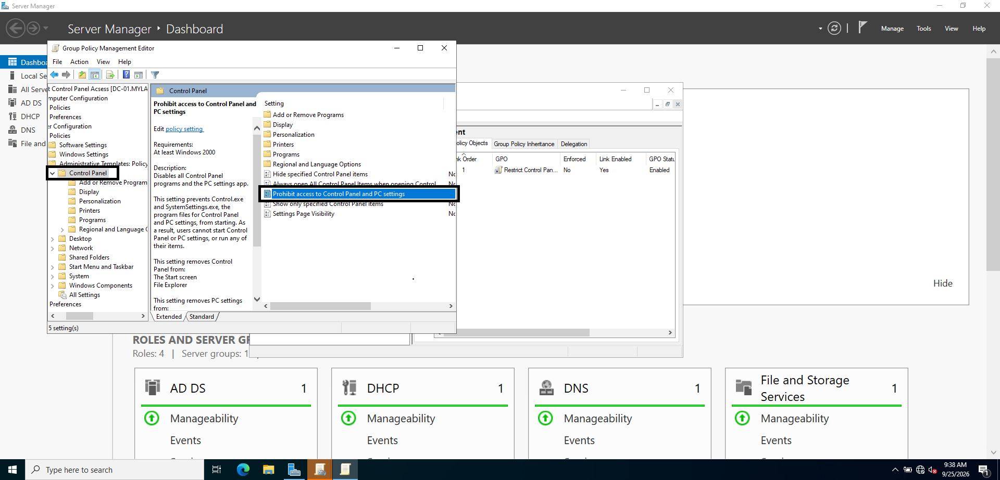

* **Objective:** Modifying Administrative Templates to restrict endpoint configuration access for standard users.
* **Configuration Details:** Using the Group Policy Management Editor, navigated to `User Configuration > Policies > Administrative Templates > Control Panel`[cite: 53]. Located and configured the rule: `Prohibit access to Control Panel and PC settings`[cite: 53].
* **System Impact:** Prevents standard users from modifying critical system settings, reducing IT overhead, preventing accidental misconfigurations, and maintaining endpoint compliance.

---

### 15. Group Policy Endpoint Verification

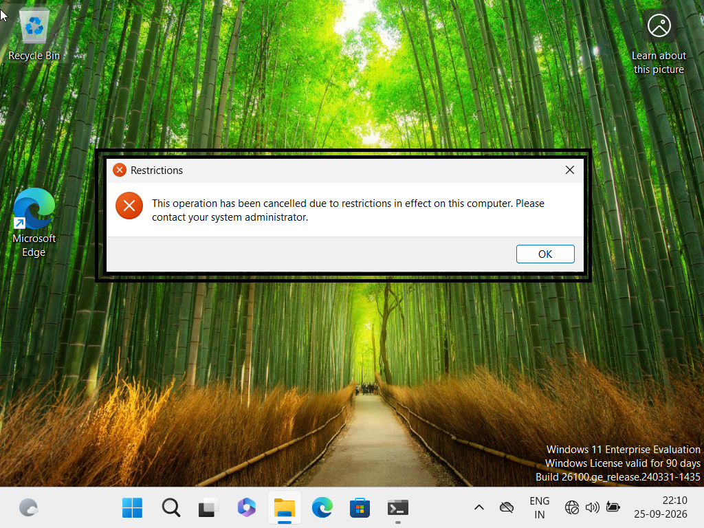

* **Objective:** Validating the successful network propagation and enforcement of the deployed GPO on the domain-joined client.
* **Test Execution:** Logged into the Windows 11 endpoint with an `IT-Department` user account and attempted to open the local Control Panel.
* **Results Verified:** Access was explicitly blocked by the OS[cite: 54]. A "Restrictions" system prompt appeared stating: *"This operation has been cancelled due to restrictions in effect on this computer. Please contact your system administrator."*

* ### 16. Domain Account Lockout Policy Configuration

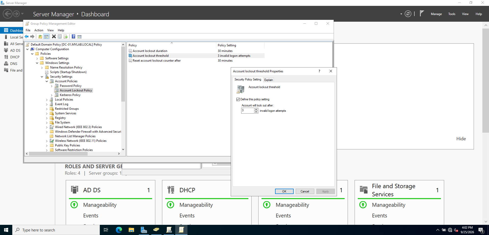
* **Objective:** Enforcing brute-force protection by configuring account lockout thresholds at the domain level.
* **Configuration Details:** Navigated to `Computer Configuration > Policies > Windows Settings > Security Settings > Account Policies > Account Lockout Policy` in the Default Domain Policy[cite: 55]. Configured the `Account lockout threshold` to trigger after `3 invalid logon attempts`[cite: 55].
* **Security Impact:** Mitigates dictionary and brute-force password attacks by disabling the account after consecutive failed authentications.

---

### 17. Client-Side Lockout Verification

* **Objective:** Validating the enforcement of the Account Lockout Policy on a domain-joined endpoint.
* **Test Execution:** Intentionally entered an incorrect password three consecutive times on the Windows 11 client logon screen.
* **Results Verified:** The system successfully blocked access, displaying the warning: *"The referenced account is currently locked out and may not be logged on to."*[cite: 56].

---

### 18. Administrative Password Reset & Account Unlock

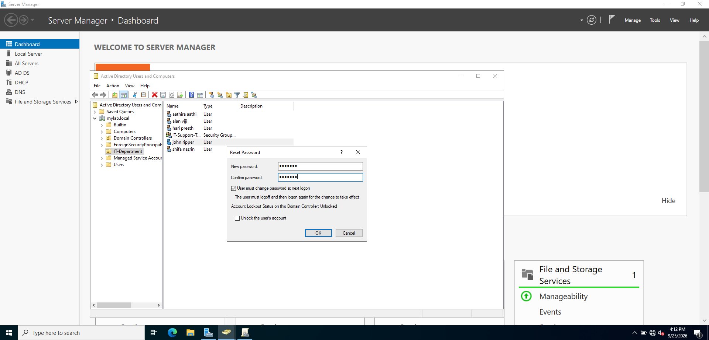
* **Objective:** Performing an administrative password reset and account unlock procedure for a locked-out user.
* **Action Performed:** Located user `shifa nazrin` within the `IT-Department` OU in ADUC and initiated a password reset[cite: 57].
* **Configuration Details:** Assigned a new temporary password and enforced the `User must change password at next logon` security requirement[cite: 57].

---

### 19. Password Reset Confirmation

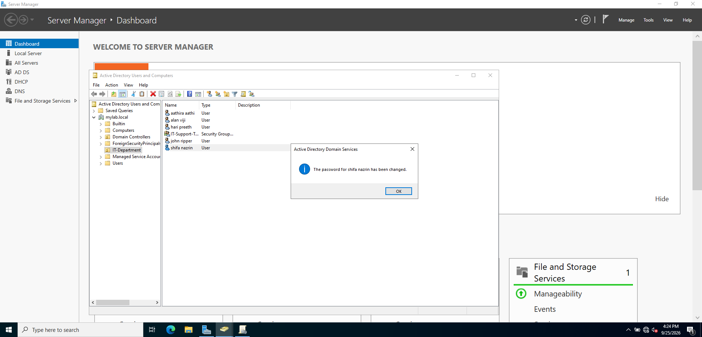
* **Objective:** Verifying the successful application of the administrative password reset command within the AD DS database.
* **Results Verified:** Received the Active Directory Domain Services confirmation prompt stating *"The password for shifa nazrin has been changed."*[cite: 58].

---

### 20. Enforced Password Change at Next Logon

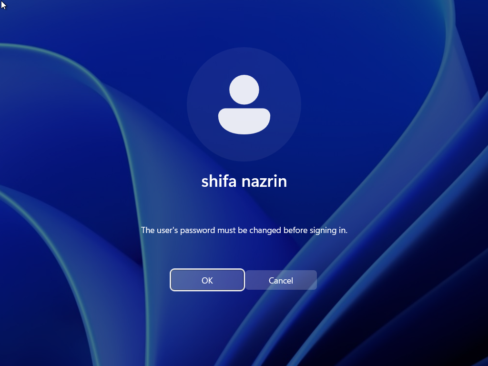
* **Objective:** Validating the mandatory password change policy upon the user's next authentication attempt.
* **Test Execution:** Attempted to log into the Windows 11 client using the temporary password provided by the administrator.
* **Results Verified:** The client intercepted the logon, prompting: *"The user's password must be changed before signing in."*[cite: 59].

---

### 21. Successful Authentication & Session Restoration

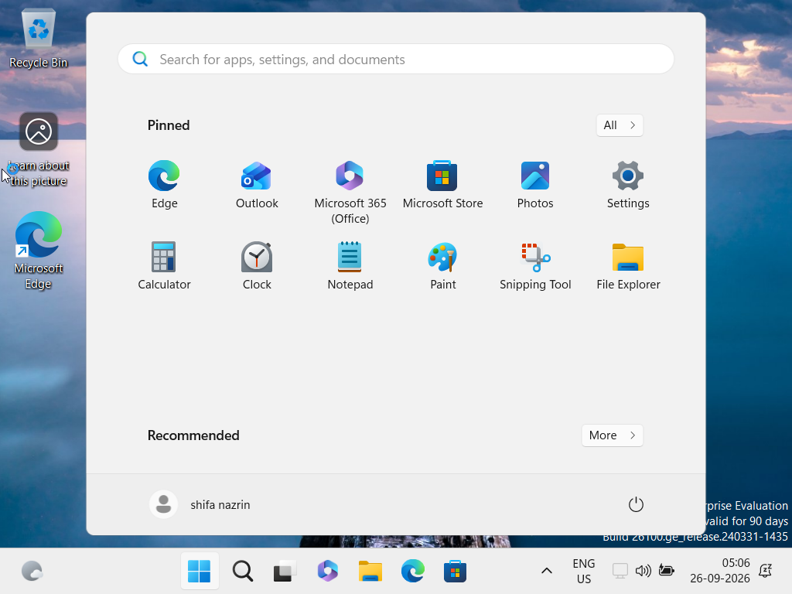
* **Objective:** Confirming complete restoration of user access following the identity remediation lifecycle.
* **Results Verified:** The user successfully established a new personalized password and gained access to the Windows 11 desktop[cite: 60]. The Start menu confirms the active session belongs to `shifa nazrin`[cite: 60].

  
